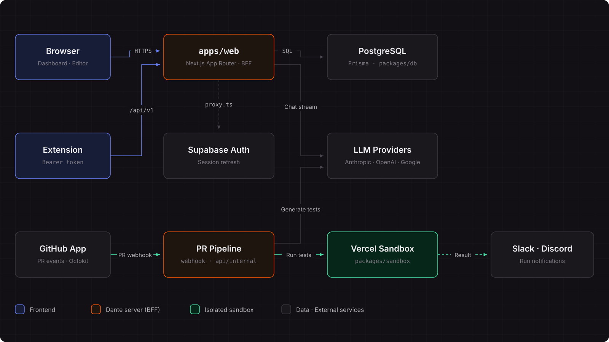

**테스트는 AI가, 레포는 깨끗하게.**

[**Dante →**](https://www.dante.ai.kr)

## 뭘 하는 제품인가

 

테스트를 안 쓰는 이유는 대개 귀찮아서가 아니라 **시작 비용과 관리 비용** 때문이다.  
어떤 파일부터 손대야 할지 모르고, 테스트 하나 돌리려고 의존성과 환경 설정을 떠안아야 한다.

**Dante는 다섯 가지 형태로 해결한다.**

1. **<mark>찾기</mark>** — AI 가 레포를 읽고 테스트가 급한 파일을 우선순위로 정렬해 준다.

2. **<mark>쓰기</mark>** — 파일을 고르고 사용자가 요청하면, AI가 해당 파일의 테스트를 작성한다.

3. **<mark>실행</mark>** — **격리된 SandBox**에서 바로 실행해 통과/실패를 보여준다. 실행에 필요한 도구는 Dante 가 **SandBox** 안에 넣어주므로 **사용자 레포는 그대로다.**

4. **<mark>수정</mark>** — 실패하면 AI 채팅으로 고치거나 에디터에서 직접 고쳐 다시 돌린다. 수정 이력은 버전으로 쌓인다.

5. **<mark>자동화</mark>** — PR 이 열리면 같은 일을 자동으로 하고, 결과를 PR, Slack, Discord 로 알린다.

 

## 핵심 기능

### <mark>AI Recommend</mark>

레포 전체를 읽어서 파일마다 "테스트가 급한 정도"를 점수로 매긴다. 분기 수, 다른 파일에서 import 되는 횟수, 코드 크기, 인증·결제 같은 도메인 위험을 가중합한다. 점수만 보여주지 않고 **왜 이 순서인지 사유까지** 같이 보여준다.

 

### <mark>AI Test · AI Chat</mark>

레포 파일 트리에서 파일을 고르면 소스와 생성된 테스트를 나란히 본다. 실행 로그는 ANSI 색 그대로 흐르고, 실패하면 채팅으로 수정해서 다시 실행한다. 테스트는 버전으로 쌓여서 이전 버전과 diff 로 비교할 수 있다.

 

### <mark>PR Auto Execution</mark>

PR이 열리면 변경된 내용을 바탕으로 테스트 파일을 생성하고, 테스트를 실행한 뒤 결과를 PR 댓글로 남긴다. 사용자가 직접 대시보드를 열어 확인할 필요가 없다.

 

### <mark>Coverage · Notification</mark>

레포의 테스트 대상 파일 중 몇 개에 테스트가 있고 그중 몇 개가 통과하는지 대시보드에서 한눈에 본다. 실행 결과는 PR, Slack, Discord로 알린다.

 

## 시스템 설계

 

  

 

## 핵심 기술 설계

**실행 환경을 Dante 가 제공한다**

- 사용자 레포지토리에는 `@testing-library/react`나 `jsdom` 같은 테스트 도구가 없는 경우가 많다. Dante는 레포지토리에서 테스트할 코드만 가져오고, `실행에 필요한 도구`는 `별도의 샌드박스 환경`에 `설치`한다. 이 과정에서 `사용자 레포지토리의 package.json은 수정하지 않는다.`

**사용자 코드는 격리된 환경에서 실행한다**

- `생성된 테스트`는 `Dante 서버가 아닌 Vercel Sandbox에서 실행`한다. 실행 시간과 네트워크 사용이 제한된 일회성 환경이기 때문에 `외부 코드를 안전하게 분리하여 실행`할 수 있다.

**데이터 접근 권한은 BFF에서 관리한다**

- 모든 테이블에 `Postgres`의 `RLS를 적용`하고 별도의 접근 정책은 설정하지 않았다. 따라서 anon 키만으로는 어떤 데이터도 조회할 수 없다. 팀 멤버 여부와 같은 `권한 검사`는 모두 `BFF에서 처리`해 `보안 관리 지점을 한곳으로 모았다.`

**민감한 정보는 암호화하여 저장한다**

- `채팅 내용, Slack 봇 토큰, Discord WebHook URL`은 `AES-256-GCM` 방식으로 `암호화해 저장`한다. GitHub Install Token은 필요할 때마다 새로 발급받으며, AI의 API Key는 서버 환경변수로만 관리한다.

**중요한 판단 로직은 순수 함수로 분리한다**

- 추천 점수 계산, 커버리지 집계, 실행 로그 분할처럼 오류를 발견하기 어려운 로직은 입출력과 분리된 순수 함수로 구현하고 단위 테스트를 작성했다.
